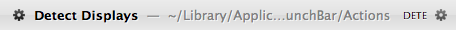
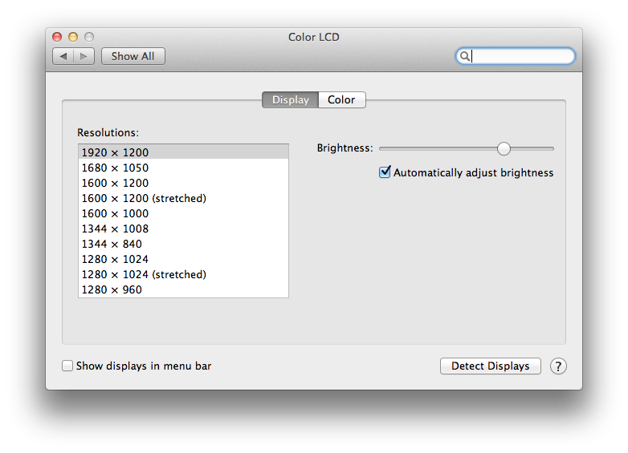

!SLIDE
# Automate Everything
## For Extra Super Fun

!SLIDE
# If you do it once...

!SLIDE
# Automate the command line
## Baby steps

!SLIDE bullets
# zsh

* Easy to do command compleation
* (Which is just anther type of automation)
* Stored in my `.zshrc`
* Anything advanced use ruby

!SLIDE bullets
# src command

## Typing `~/src/` all the time is not fun

!SLIDE commandline incremental
# src command

    $ src zi<TAB>
    ~/src/ziplist $

!SLIDE
# src command

    src(){cd ~/src/$1;}
    compctl -W ~/src -/ src
!SLIDE
# Pow
## Always restarting is not super

!SLIDE
# kapow command

    function kapow {
      touch ~/.pow/$1/tmp/restart.txt
      if [ $? -eq 0 ]; then
        echo "Pow restarting $1..."
      fi
    }
    compctl -W ~/.pow -/ kapow

!SLIDE commandline incremental
# kapow command

    $ kapow ziplist
    Kapow! Restarted ziplist.dev
<!-- !SLIDE bullets incremental
# kapow command

* Fixed initial annoyance
* Improved on it
* Added fun
--> 
!SLIDE commandline incremental
# extra super kapow command

    $ kapow
                --_--
             (  -_    _).
           ( ~       )   )
         (( )  (    )  ()  )
          (.   )) (       )
            ``..     ..``
                 | |
               (=| |=)
                 | |       Kapow! Restarted ziplist.dev
             (../( )\.))

!SLIDE
# Automate remembering
!SLIDE
# ssh-keyput command
## Remembering permissions on .ssh/knownhosts is not extra

!SLIDE commandline incremental
# ssh-keyput

    $ gem install ssh-keyput
    Successfully installed ssh-keyput-0.4.0
    1 gem installed
    $ ssh-keyput my.server.com

!SLIDE
# Automate your system
!SLIDE
# Detect displays
## Opening and navigating system prefs is not super extra
!SLIDE
# Detect Displays
## LaunchBar and AppleScript

!SLIDE

!SLIDE
# Detect Displays

    tell application "System Preferences"
      activate
      reveal anchor "displaysDisplayTab" of pane id "com.apple.preference.displays"
      tell application "System Events"
        tell application process "System Preferences"
          tell window 1
            click button "Detect Displays"
          end tell
        end tell
      end tell
      quit
    end tell

!SLIDE
# fin

