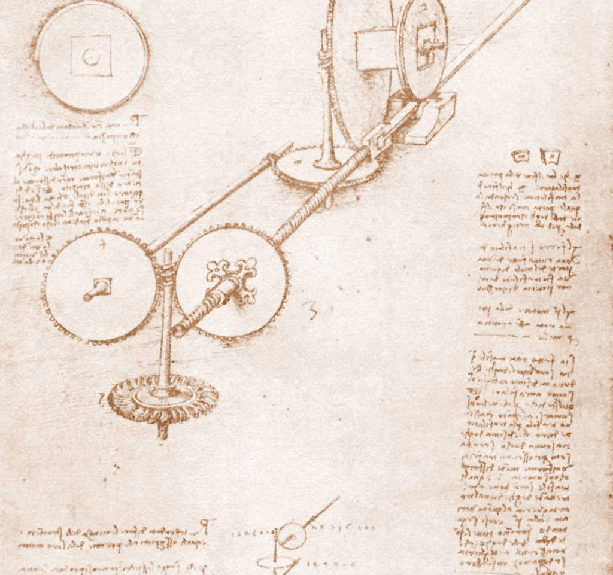
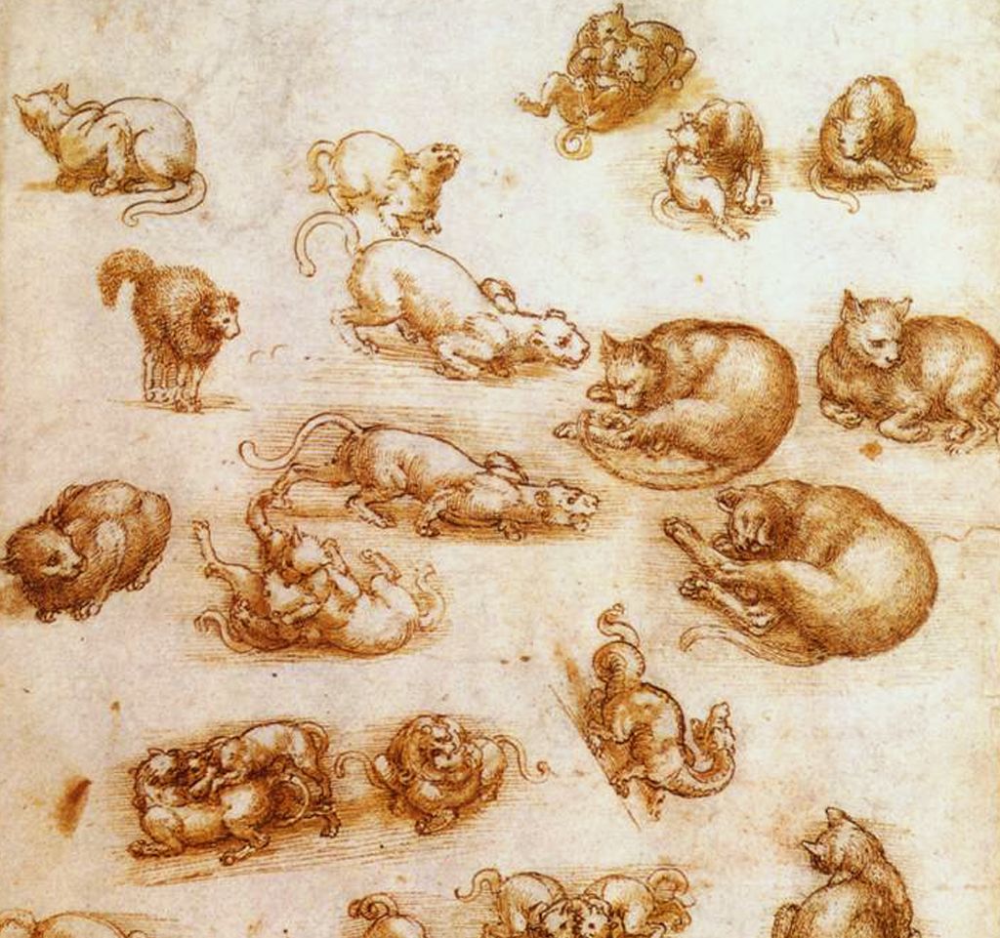

!SLIDE
# Automate Everything #
## For Extra Super Fun

!SLIDE
# If you do it once... #

!SLIDE
# Automate the command line
## Baby steps

!SLIDE bullets
# zsh #

* Easy to do command compleation
* (Which is just anther type of automation)
* Stored in my `.zshrc`
* Anything advanced falls back ruby

!SLIDE bullets
# Pow
## Always restarting

!SLIDE bullets
# Pow
## Always restarting

!SLIDE commandline incremental
# Kapow

    $ src ziplist
    Using /Users/csexton/.rvm/gems/ruby-1.8.7-p302 with gemset ziplist
    $ kapow ziplist
    Kapow! Restarted ziplist.dev

!SLIDE bullets incremental
# Kapow
* Fixed initial annoyance
* Improved on it
* Added fun

!SLIDE commandline incremental
# Kapow

    $ src ziplist
    Using /Users/csexton/.rvm/gems/ruby-1.8.7-p302 with gemset ziplist
    $ kapow
                --_--
             (  -_    _).
           ( ~       )   )
         (( )  (    )  ()  )
          (.   )) (       )
            ``..     ..``
                 | |
               (=| |=)
                 | |       Kapow! Restarted ziplist.dev
             (../( )\.))

!SLIDE bullets
# src command #

* Very common task
* Generic solution

!SLIDE commandline incremental
# src command #

    $ src zi<TAB>
    ~/src/ziplist $

!SLIDE commandline incremental
# Automate remembering
## ssh-keyput

!SLIDE commandline incremental
# ssh-keyput

    $ gem install ssh-keyput
    Successfully installed ssh-keyput-0.4.0
    1 gem installed
    $ ssh-keyput my.server.com

!SLIDE
# Automate your system
## Detect displays
!SLIDE
# Detect displays #

## LaunchBar and AppleScript

!SLIDE
# Detect displays #

    tell application "System Preferences"
      activate
      reveal anchor "displaysDisplayTab" of pane id "com.apple.preference.displays"
      tell application "System Events"
        tell application process "System Preferences"
          tell window 1
            click button "Detect Displays"
          end tell
        end tell
      end tell
      quit
    end tell

!SLIDE
# fin

